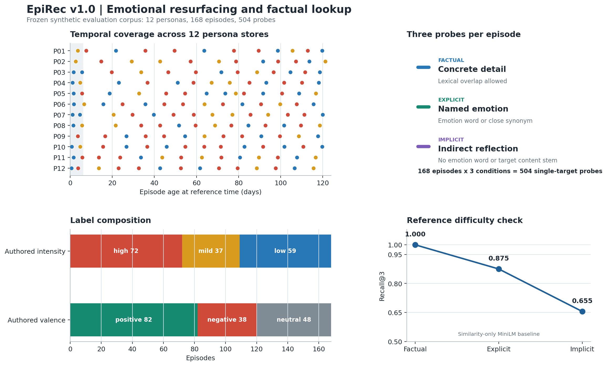

<div align="center">

# EpiRec

**메모리 증강 에이전트의 정서적 회상과 사실 검색을 위한 에피소드 회상 벤치마크**

[English](README.md) | [한국어](README.ko.md) | [中文](README.zh-CN.md)

**12 personas | 168 episodes | 504 retrieval probes | English | synthetic**

</div>

EpiRec은 메모리 증강 에이전트의 두 검색 능력을 분리해서 평가합니다.

| 능력 | 예시 질문 | 평가 목적 |
|---|---|---|
| 사실 검색 | "라멘집에서 무엇을 주문했지?" | 특정 에피소드의 구체적인 사실을 찾는 능력 |
| 정서적 회상 | "물가에서 보낸 그 저녁이 아직도 떠올라." | 간접적인 성찰 문장에서 정서적으로 중요한 과거 사건을 되찾는 능력 |

LoCoMo 같은 장기 메모리 벤치마크는 사실 기반 검색 평가에 강점이 있지만 정서적 중요도 label은 제공하지 않습니다. EpiRec은 이 축을 보완하기 위해 만든 소규모 synthetic evaluation benchmark입니다. 실제 인간의 기억, 정서, 정신건강 효과를 주장하는 용도로 사용하면 안 됩니다.

<p align="center"></p>

## 데이터와 과제

12명의 fictional persona마다 날짜가 있는 14개 1인칭 journal episode가 있으며, 각 episode에는 하나씩의 probe가 있습니다.

| Probe | 생성 규칙 |
|---|---|
| `factual` | 구체적인 사실을 직접 묻는 질문. 어휘 중복 허용. |
| `reflective_explicit` | 감정 또는 유사어를 명시하는 1인칭 성찰. |
| `reflective_implicit` | 독립 감정 어휘와 target episode의 content-word stem을 재사용하지 않는 간접 성찰. |

Release artifact는 [`data/epirec_v1.json`](data/epirec_v1.json)입니다. probe의 target은 해당 probe를 포함한 episode이며, timestamp는 ISO-8601 UTC 형식입니다. 평가 시 persona별로 하나의 retrieval store를 구성하고 `reference_now`를 time-aware scoring에 사용합니다.

## 평가 규약

[GENERATION_SPEC.md](GENERATION_SPEC.md)에 고정된 규약은 다음과 같습니다.

- persona별 14개 episode를 하나의 store로 사용합니다.
- 504개 probe 전체를 평가하며, primary metric은 recall@3입니다.
- recall@1, MRR도 함께 보고합니다.
- 전체 점수뿐 아니라 probe type, authored intensity band, age range별 결과를 분리 보고합니다.
- `factual`, `reflective_explicit`, `reflective_implicit` 결과를 하나의 headline score로 합치지 않습니다.

이 데이터는 training split이 없는 evaluation-only benchmark입니다.

## 재현

```bash
python scripts/validate.py            # schema, protocol, release, checksum 검증
python scripts/build.py --check       # release artifact가 최신인지 확인
python scripts/baseline_retrieval.py  # hashing baseline, MiniLM은 설치되어 있을 때 추가 실행
```

[`data/SHA256SUMS`](data/SHA256SUMS)는 release JSON의 정확한 checksum을 고정합니다. GitHub Actions는 push와 pull request마다 source, release, manifest의 일치 여부를 검사합니다.

## 한계와 무결성

- 모든 persona, episode, probe는 Claude (Anthropic)를 이용해 supervised session에서 작성한 fictional synthetic data입니다.
- validator는 ID와 text/query 중복, 시간대, 길이, session span, label 분포, temporal coverage, probe 규칙, implicit probe lexical leakage를 검사합니다.
- 60개 episode의 독립 human label audit은 [`human_validation/`](human_validation/)에 준비되어 있으나 v1.0에서는 아직 pending입니다. 따라서 authored intensity/valence는 현재 design label로 해석해야 합니다.
- English-only, single-target, authored small benchmark이며 ecological validity를 입증하지 않습니다.

상세한 데이터 기록은 [DATASHEET.md](DATASHEET.md), 생성 규칙은 [GENERATION_SPEC.md](GENERATION_SPEC.md)를 참고하세요.

## License and Citation

Data는 [CC BY 4.0](LICENSE), code는 [MIT](LICENSE)로 공개됩니다. 인용 정보는 [English README](README.md)의 Citation 섹션을 사용하세요.
