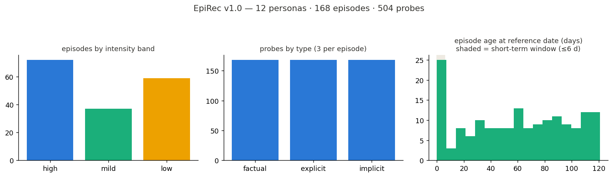

<div align="center">

# EpiRec

**Episodic Recall: A Benchmark for Emotional Resurfacing and Factual Lookup in Memory-Augmented Agents**

[](LICENSE)
[](LICENSE)
[](data/epirec_v1.json)
[](https://github.com/sukoji/epirec/actions/workflows/validate.yml)

**12 personas | 168 episodes | 504 retrieval probes | English | synthetic**

[English](README.md) | [Korean](README.ko.md) | [Chinese](README.zh-CN.md)

</div>

EpiRec evaluates two different capabilities of a memory-augmented agent:

| Capability | Question | Why it matters |
|---|---|---|
| Factual lookup | "What did I order at the ramen place?" | Tests whether a system retrieves a concrete episodic detail. |
| Emotional resurfacing | "That evening by the water still comes back to me." | Tests whether a system retrieves an emotionally meaningful episode from an indirect reflection. |

Existing long-term-memory benchmarks such as [LoCoMo](https://github.com/snap-research/locomo) provide strong factual-recall evaluation, but do not include emotional-salience labels. EpiRec complements them with a small, fully disclosed synthetic benchmark designed for this missing axis. It is evaluation-only and must not be used to support claims about real human memory or mental-health outcomes.

<p align="center"></p>

## Data

Each of 12 fictional personas has 14 dated first-person journal episodes. Every episode has one probe of each type:

| Probe type | Construction rule | Example use |
|---|---|---|
| `factual` | Direct question about a concrete detail; lexical overlap is allowed. | Factual episodic lookup |
| `reflective_explicit` | First-person reflection that names the emotion or a close synonym. | Emotion-aware retrieval |
| `reflective_implicit` | First-person reflection with no independent emotion-vocabulary word and no content-word stem shared with its target. | Indirect emotional resurfacing |

The released artifact is [`data/epirec_v1.json`](data/epirec_v1.json). Its top-level structure is:

```text
reference_now
personas[]
  persona_id
  episodes[]
    id, session, date_time, text, emotion, intensity_band, valence
    probes[]
      id, type, query
```

Each probe targets the episode that contains it. Timestamps are ISO-8601 UTC values. Agents should form one retrieval store per persona and use `reference_now` for time-aware scoring.

## Benchmark Protocol

The fixed protocol is defined in [GENERATION_SPEC.md](GENERATION_SPEC.md):

- One store per persona, containing all 14 episodes.
- Evaluate every one of the 504 probes against its containing episode as the single target.
- Report recall@3 as the primary metric, plus recall@1 and MRR.
- Report results overall, by probe type, and for reflective probes by authored intensity band and age range.
- Keep `factual`, `reflective_explicit`, and `reflective_implicit` separate. Do not collapse them into a single headline score.

The corpus has no training split. It is not a leaderboard for fine-tuning; it is a diagnostic evaluation set.

## Baselines

Reference baselines are generated by [`scripts/baseline_retrieval.py`](scripts/baseline_retrieval.py). With MiniLM embeddings, v1.0 has the intended difficulty gradient:

| Strategy | Factual recall@3 | Explicit recall@3 | Implicit recall@3 | Overall |
|---|---:|---:|---:|---:|
| Recency-only | 0.214 | 0.214 | 0.214 | 0.214 |
| Similarity-only (hashing) | 0.857 | 0.488 | 0.304 | 0.550 |
| Similarity-only (MiniLM) | 1.000 | 0.875 | 0.655 | 0.843 |

These are reference retrieval baselines, not a claim that a method solves emotional resurfacing. The substantial gap on `reflective_implicit` probes is intentional headroom.

## Reproduce

The repository has no mandatory runtime dependency for release validation. `sentence-transformers` is optional for the MiniLM baseline.

```bash
python scripts/validate.py            # source schema, protocol, release, and checksum checks
python scripts/build.py --check       # confirms generated artifact is current without writing files
python scripts/baseline_retrieval.py  # hashing baseline; MiniLM too when installed
```

To intentionally rebuild the release artifact after a versioned dataset change:

```bash
python scripts/build.py
```

`data/SHA256SUMS` pins the current artifact. Both validation commands fail when the release JSON, persona sources, or checksum manifest diverge. GitHub Actions runs these checks for every push and pull request.

## Integrity And Limits

- **Synthetic and disclosed:** all personas, episodes, and probes were authored with Claude (Anthropic) in a supervised session. No real-person or user data is included.
- **Fixed construction protocol:** the public specification describes data shape, label bands, timeline coverage, probe rules, and evaluation before a release version is frozen.
- **Mechanical checks:** the validator enforces unique IDs, source/release agreement, text length, session span, label mix, temporal coverage, probe completeness, and implicit-probe lexical constraints.
- **Independent label audit:** a deterministic, stratified 60-episode sample is in [`human_validation/`](human_validation/). Ratings remain pending in v1.0; authored intensity and valence labels should therefore be treated as design labels until agreement is reported.
- **Known scope:** English-only, single-target, authored text, a small evaluation set, and no evidence of ecological validity. EpiRec must not be used for clinical, mental-health, or real-user claims.

See [DATASHEET.md](DATASHEET.md) for the full dataset record and [GENERATION_SPEC.md](GENERATION_SPEC.md) for construction rules.

## License

Data is released under [CC BY 4.0](LICENSE). Code is released under [MIT](LICENSE).

## Citation

```bibtex
@misc{epirec2026,
  title  = {EpiRec: Episodic Recall: A Benchmark for Emotional Resurfacing and Factual Lookup in Memory-Augmented Agents},
  author = {Jin, Seokho},
  year   = {2026},
  url    = {https://github.com/sukoji/epirec},
  note   = {Version 1.0. Synthetic corpus generated with Claude (Anthropic).}
}
```
